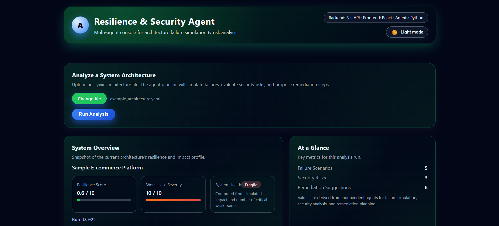
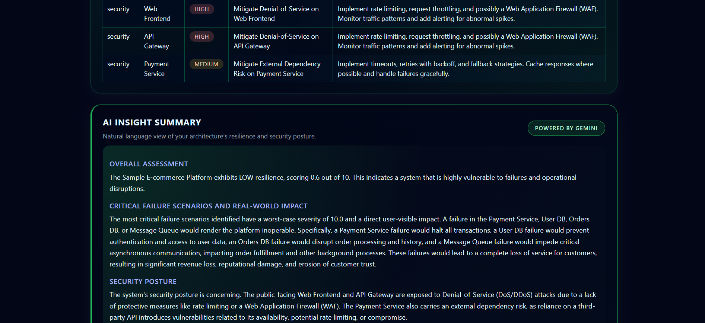
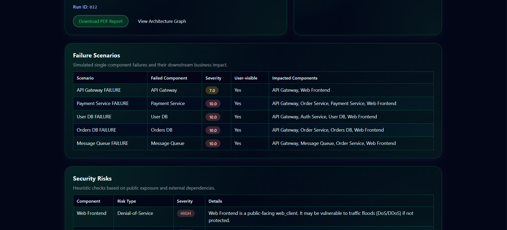
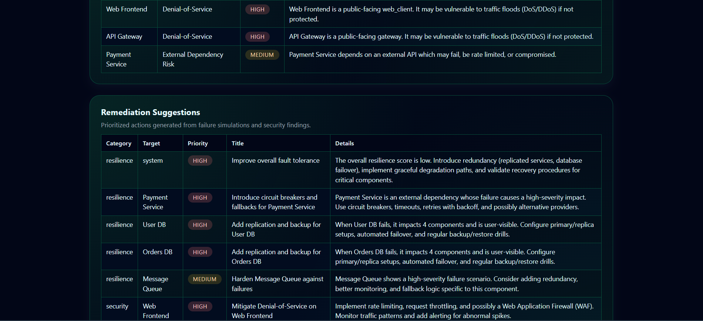
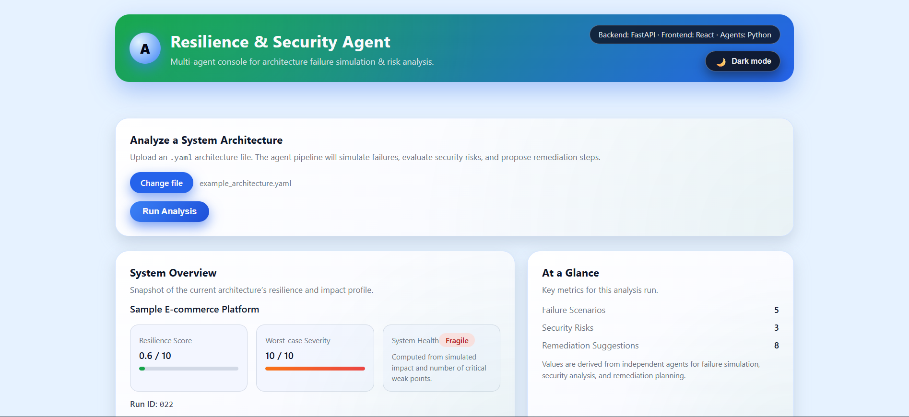
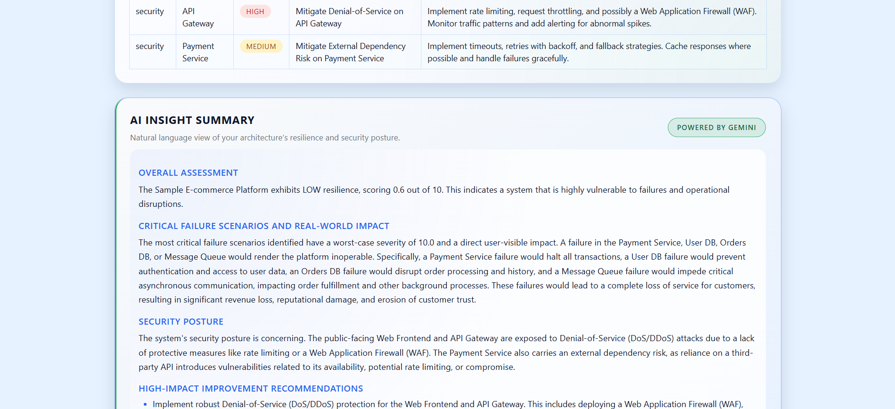
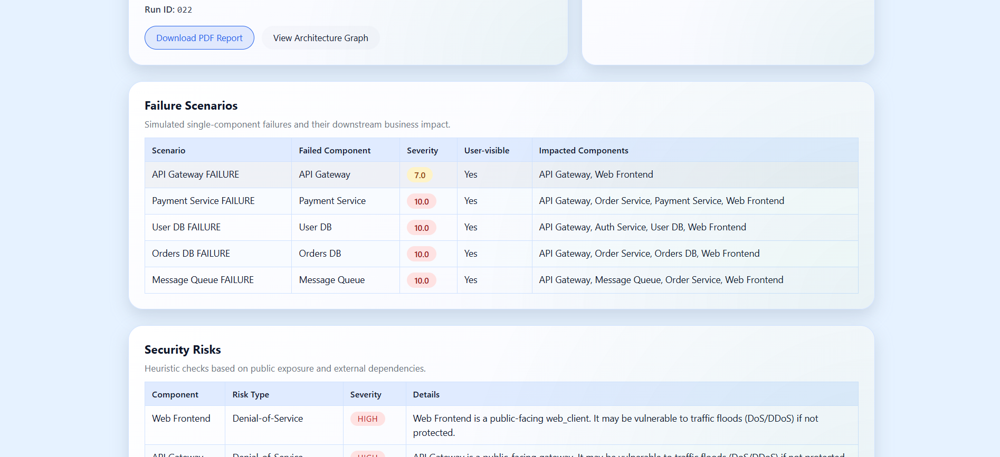
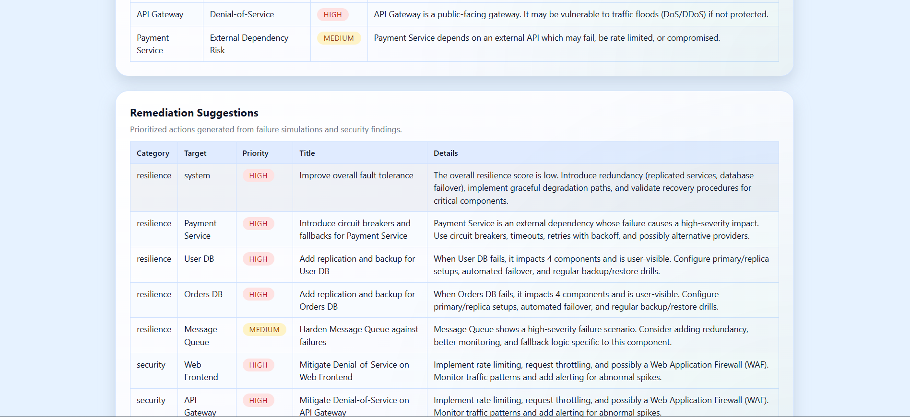

# FortifyAI – Multi-Agent Resilience & Security Advisor

FortifyAI is a **multi-agent AI system** that analyzes a software architecture (defined in YAML), simulates **failure scenarios**, detects **security risks**, and generates **actionable remediation plans** along with an **AI-powered executive summary**.

It is designed as a realistic **SRE + Security Copilot** for system architects, DevOps engineers, and cloud engineers.

---

## 🚀 Key Capabilities

FortifyAI provides:

* 🔁 Failure impact simulation across system components
* 🔐 Automated security risk detection
* 📉 Resilience scoring & worst-case severity analysis
* 🧠 AI-powered executive summaries (Gemini-enhanced)
* 📊 Visual architecture graphs
* 📄 PDF & Markdown reports
* 🗂 Per-run artefacts with full traceability

---

## 🔍 What FortifyAI Does

Given an architecture YAML file, FortifyAI will:

* Build a **dependency graph** of your system
* Simulate **single-component failures** and propagate impact
* Compute for each scenario:

  * Severity (0–10)
  * Whether the failure is user-visible
  * All impacted components
* Run heuristic security checks:

  * DoS risk for public-facing services
  * External dependency risk for third-party integrations
* Generate:

  * Structured system report
  * Prioritized remediation plan
  * AI insight summary (Gemini-powered if configured)

---

## 🧠 Multi-Agent Architecture

### Input

A YAML file defining:

* Components
* Types
* Dependencies
* Criticality
* Public exposure

### Core Agents

#### 1. Orchestrator Agent

Coordinates the entire workflow and:

* Assigns a sequential run ID (`runs/run_001`, `runs/run_002`, ...)
* Invokes all other agents
* Aggregates outputs
* Logs execution state in `agent_context.json`

#### 2. Failure Simulation Agent

* Simulates failure of each component
* Propagates impact across dependency graph
* Calculates:

  * Severity
  * User visibility
  * Impacted components

#### 3. Security Analysis Agent

* Analyzes metadata such as `type`, `public`, `external_api`
* Flags:

  * Denial-of-Service risk
  * External dependency vulnerabilities

#### 4. Reporting Agent

Generates:

* `report.json`
* `report.md`
* `report.pdf`
* `architecture_graph.png`

Includes:

* Resilience score
* Worst-case severity
* Failure scenarios
* Security risks

#### 5. Remediation Agent

Suggests actions with:

* Category (resilience, security, architecture)
* Target component
* Priority (high / medium / low)
* Description and implementation guidance

Enhanced when Gemini is enabled.

#### 6. AI Summary Agent

* Converts technical output into an executive summary
* Uses **Gemini 2.5 Flash Lite** when API key is present
* Falls back to heuristic summaries when unavailable
* UI clearly displays source (Gemini / Heuristic)

---

## 📁 Per-Run Artefacts

Each run produces:

```
runs/run_003/
├─ architecture.yaml
├─ report.json
├─ report.md
├─ report.pdf
├─ architecture_graph.png
├─ remediation.json
├─ remediation.txt
├─ ai_summary.txt
└─ agent_context.json
```

> These folders are auto-generated and excluded from Git.

---

## 🖼 UI Screenshots

All screenshots are stored in:

```
docs/screenshots/
```

### 🌙 Dark Mode






### ☀️ Light Mode






> Full screenshots available in the `docs/screenshots/` folder.

---

## 🧰 Tech Stack

### Backend

* Python 3.12+
* FastAPI
* Uvicorn
* Graphviz
* ReportLab
* python-dotenv
* google-generativeai (Gemini 2.5 Flash Lite)

### Frontend

* React (Vite)
* Custom CSS (no UI framework)
* Light/Dark mode
* Responsive design

---

## 📂 Project Structure

```
Fortify-AI/
├─ api.py
├─ main.py
├─ architecture_model.py
├─ orchestrator.py
├─ failure_simulation.py
├─ security_analysis.py
├─ remediation_agent.py
├─ ai_summary_agent.py
├─ llm_client.py
├─ agent_context.py
├─ report_storage.py
├─ report_generator.py
├─ graph_utils.py
├─ run_utils.py
├─ requirements.txt
├─ example_architecture.yaml
├─ frontend/
└─ runs/
```

---

## ⚙️ Setup

### Backend

```bash
pip install -r requirements.txt
uvicorn api:app --reload
```

Optional Gemini setup:

```
GEMINI_API_KEY=your_key_here
```

### Frontend

```bash
cd frontend
npm install
npm run dev
```

---

## 🎓 Academic Context

This project was developed as an academic capstone to demonstrate:

* Agentic AI system design
* Hybrid reasoning (deterministic + LLM)
* Resilience engineering simulations

You may reference this work if using it in your own research or coursework.

---

## 📜 License

MIT License – see the LICENSE file for details.

---

## 🧹 Utility Script

`cleanup_empty_runs.py`
Removes incomplete or empty run folders from the `runs/` directory during development testing.
