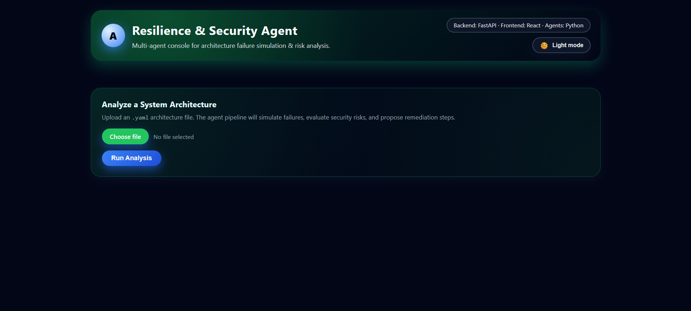

# FortifyAI – Multi-Agent Resilience & Security Advisor

FortifyAI is a **multi-agent AI system** that analyzes a software architecture (defined in YAML), simulates failure scenarios, detects security risks, and generates actionable remediation plans along with an AI-powered executive summary.

It is designed as a realistic **SRE + Security Copilot** for system architects and cloud engineers.

---

## 🚀 Key Capabilities

FortifyAI provides:

- 🔍 Failure impact simulation across system components  
- 🛡️ Automated security risk detection  
- 📈 System resilience scoring  
- 🤖 AI-powered executive insights (Gemini-enhanced)  
- 📊 Visual architecture dependency graphs  
- 🧾 PDF, JSON and Markdown reports  
- ⚙️ Multi-agent orchestration with traceable run context

---

## 🖥️ Application Preview

### Dark Mode



### Light Mode


➡️ View all screenshots here:  
`docs/screenshots/`

---

## 🔍 What FortifyAI Does

Given an architecture YAML file, FortifyAI will:

### ✅ Failure Simulation
- Simulate single-component failure
- Propagate effects through dependency chains
- Calculate:
  - Severity (0–10)
  - User-visible impact
  - Impacted components

### ✅ Security Analysis
- Detect risks such as:
  - DoS vulnerability on public services
  - External dependency exposure
- Assign severity levels: HIGH / MEDIUM / LOW

### ✅ Reporting & Insights
- Generate:
  - System Report (JSON)
  - PDF Report
  - AI Insight Summary
  - Remediation Plan

---

## 🧠 Multi-Agent Architecture

### 1. Orchestrator Agent
Coordinates the entire pipeline and assigns run IDs.

### 2. Failure Simulation Agent
Simulates component-level failures and downstream impact.

### 3. Security Analysis Agent
Scans for architecture-level security issues.

### 4. Reporting Agent
Generates structured reports and visual graph outputs.

### 5. Remediation Agent
Proposes prioritized fixes based on risk.

### 6. AI Summary Agent
Creates a readable executive summary using:
- ✅ Gemini 2.5 Flash Lite (if API key present)
- ✅ Heuristic engine fallback (offline mode)

---

## 📦 Per-Run Output Structure

Each analysis run generates:

```text
runs/
└─ run_003/
   ├─ architecture.yaml
   ├─ report.json
   ├─ report.md
   ├─ report.pdf
   ├─ architecture_graph.png
   ├─ remediation.json
   ├─ remediation.txt
   ├─ ai_summary.txt
   └─ agent_context.json
```

These folders are auto-generated and ignored by Git.

---

## 🧰 Tech Stack

### Backend
- Python 3.12
- FastAPI
- Uvicorn
- Graphviz
- ReportLab
- Gemini API (google-generativeai)
- python-dotenv

### Frontend
- React (Vite)
- Pure CSS
- Light/Dark Mode UI
- Responsive futuristic design

---

## ⚙️ Setup Instructions

### Backend

```bash
python -m venv venv
venv\Scripts\activate
pip install -r requirements.txt
uvicorn api:app --reload
```

Access backend at:
```
http://127.0.0.1:8000
```

### Frontend

```bash
cd frontend
npm install
npm run dev
```

Access UI at:
```
http://127.0.0.1:5173
```

---

## 🔐 Gemini Setup (Optional)

Create a `.env` file:

```
GEMINI_API_KEY=your_api_key_here
```

Without the key, the system still works using heuristic summaries.

---

## 📄 Sample YAML Input

```yaml
system_name: "Sample E-commerce Platform"
components:
  - name: Web Frontend
    type: web_client
    public: true
    criticality: medium
    depends_on: [API Gateway]

  - name: API Gateway
    type: gateway
    public: true
    criticality: high
    depends_on: [Auth Service, Order Service]
```

---

## 🧪 Utility Script

`cleanup_empty_runs.py`  
Removes incomplete run folders during testing.

---

## 📚 Project Context

FortifyAI was developed as an academic and learning-focused capstone demonstrating:

- Agentic AI design
- Hybrid intelligence (LLM + logic)
- Risk modeling & system resilience analysis

Attribution is appreciated but not required.

---

## 📜 License

This project is licensed under the **MIT License**  
See `LICENSE` for details.

---

## 👤 Author

Vedang Mirgal  
AI & Systems Engineering Enthusiast  
2025
